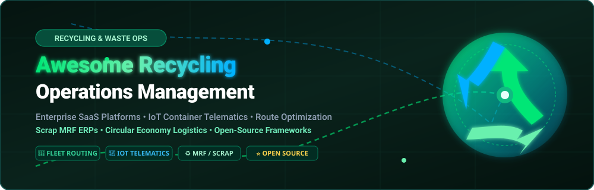

  

  
  
  
  
  
  
  
  

# ♻️ Awesome Recycling Operations Management

> **A curated directory of enterprise SaaS platforms, logistics route optimization engines, IoT smart container monitors, scrap MRF ERPs, and open-source AI projects driving the circular economy.**

**Last updated: September 2026**

---

## 📖 Overview & Ecosystem Guide

Welcome to the definitive industry resource for **Recycling Operations Management Software**. This curated index benchmarks commercial software suites and open-source codebases designed for waste collection haulers, scrap recyclers, municipalities, and Material Recovery Facilities (MRFs).

Key operational disciplines covered:
- 🚛 **Collection Route Optimization & Dispatch**: Dynamic vehicle route planning, turn-by-turn navigation, missed pickup tracking, and commercial roll-off scheduling.
- 📡 **Smart Container Telematics & IoT**: Ultrasonic and optical fill-level sensing, contamination detection via computer vision, and dumpster tilt/theft tracking.
- ⚖️ **MRF & Scale-House Ticketing**: Gross/tare weight capture, automated driver license / license plate scanning, commodity grading, and instant payment disbursements.
- 📈 **Commodity Trading & Scrap Inventory**: Baled recyclable inventory, weighted average costing, freight scheduling, and brokerage contract management.
- 📋 **Environmental Compliance & ESG Analytics**: Landfill diversion calculation, state/provincial regulatory e-manifests, and corporate carbon footprint reporting.

---

## 📑 Table of Contents

- [🏢 SaaS / Hosted Platforms](#-saashosted-platforms)
- [💻 Open-Source GitHub Projects](#-open-source-github-projects)
- [🛠️ Additional Open-Source Building Blocks](#️-additional-open-source-building-blocks)
- [📈 Star History](#-star-history)
- [🤝 How to Contribute](#-how-to-contribute)
- [📜 Disclaimer](#-disclaimer)

---

## 🏢 SaaS/Hosted Platforms

> 📊 **Sector Market Size & Structure**: The global waste and recycling operations management software market is estimated at **$2.8 Billion in 2024**, projected to reach **$6.2 Billion by 2031** growing at a **12.1% CAGR**. The sector is **moderately to highly fragmented** (rather than a concentrated winner-take-all market), driven by localized municipal hauling franchises, distinct operational niches (municipal curbside collection, commercial roll-off dumpsters, scrap metal recycling, MRF commodity trading), and regional private haulers deploying specialized modular ERPs and IoT telematics.

| 🏢 Platform | 📦 Description & Key Focus | 📊 Company Size (Revenue / Valuation) | 💰 Starting Pricing | 🆓 Free Tier / Trial Limits |
| :--- | :--- | :--- | :--- | :--- |
| **[AMCS Platform](https://www.amcsgroup.com/)** | Global enterprise waste & recycling ERP managing fleet dispatch, route optimization, MRF facilities, scale ticketing, and ESG reporting. | ~$1.5B+ Valuation \| ~$160M+ ARR (Backed by EQT, Clearlake Capital & Insight Partners) | Starts at $1,250/month (base operational package billed annually at ~$15,000/year for core fleet and facility modules) | No free-forever tier; offers 14-day guided proof-of-concept pilot with sample facility data upon qualification (0 days public self-serve trial) |
| **[Rubicon](https://www.rubicon.com/)** | Smart waste marketplace & municipal fleet platform providing in-cab telematics, turn-by-turn route management, and diversion analytics. | ~$1.0B Peak SPAC Valuation \| ~$675M Annual Revenue (Acquired by Routeware / Rodina in 2024) | Starts at $200/vehicle/month (or base municipal deployment from $7,000/month for fleets up to 30 collection vehicles) | No free-forever tier; provides 60-day to 6-month municipal pilot trials (limited to 5–10 pilot vehicles with in-cab hardware deployment) |
| **[Compology](https://www.compology.com/)** | AI-powered dumpster camera and container sensor monitoring that rightsizes collection schedules and spots contamination. | ~$600M+ Parent Valuation (Acquired by RoadRunner Recycling for ~$60M–$80M; ~$12M+ ARR) | Starts at $10/container/month (camera hardware, automated image analysis, and web portal access subscription) | No free-forever tier; 30-day pilot trial program (limited to up to 5 containers with sensor installation) |
| **[Recycle Track Systems (RTS)](https://www.rts.com/)** | Technology-enabled waste hauling logistics and Pello AI sensor-driven container fill and contamination monitoring. | ~$350M Valuation \| ~$85M+ Annual Revenue ($120M+ venture funding; B-Corp certified) | Starts at $25/sensor/month (for Pello IoT container sensors; commercial hauling management plans start at $500/month) | No free-forever tier; 14-day free pilot trial for Pello container sensors (includes test hardware sensor unit and cloud portal access) |
| **[Route4Me](https://www.route4me.com/)** | High-density route planning and dynamic dispatch software tailored for curbside waste, recycling collection, and roll-off haulers. | ~$250M–$300M Est. Valuation \| ~$40M+ ARR (Profitable bootstrapped/growth logistics SaaS) | Starts at $199/month (core route optimization plan for up to 10 team members/drivers) | 7-day free trial with full route optimization features; or free mobile edition limited to 10 stops per route |
| **[Soft-Pak](https://www.soft-pak.com/)** | Established fleet operations and billing suite managing residential/commercial waste routes, container inventory, and scale terminals. | ~$150M Est. Valuation \| ~$35M+ ARR (Subsidiary of Dover Corp, NYSE: DOV, $25B Market Cap) | Starts at $100/truck/month (or entry-level standalone billing package starting at $1,200/year) | No free-forever tier; offers scheduled live 1-on-1 virtual product walkthrough demo with technical advisors (0 days public trial) |
| **[CurbWaste](https://www.curbwaste.com/)** | Modern cloud ERP for waste haulers, transfer stations, and recyclers with real-time dispatch, customer portal, and automated billing. | ~$70M Valuation \| ~$6M+ ARR (Series A funded; $20M+ raised from M13 & Initialized) | Starts at $150/truck/month (or entry-level operator tier starting at $450/month for up to 3 trucks) | No free-forever tier; offers 14-day guided pilot onboarding and custom sandbox demo upon consultation |
| **[cieTrade](https://cietrade.com/)** | Specialized recycling and scrap facility ERP managing scale ticketing, inventory valuation, commodity brokerage, and export freight. | ~$35M Est. Valuation \| ~$12M+ ARR (Established independent scrap & recycling ERP provider) | Starts at $375/month (base tier for 3 concurrent users on a month-to-month subscription) | No free-forever tier; offers personalized live system demonstration and sample workflow testing (0 days public self-serve trial) |
| **[Evreka](https://evreka.co/)** | Smart waste and recycling operations platform featuring IoT bin/container fill-level monitoring, route optimization, and MRF tracking. | ~$25M–$30M Valuation \| ~$5M+ ARR (Venture-backed global smart waste IoT & SaaS in 20+ countries) | Starts at $35/vehicle/month (or entry fleet management tier starting at $250/month) | No free-forever tier; 14-day guided pilot trial available on request (includes IoT monitoring dashboard and up to 5 tracking assets) |
| **[ReMatter](https://www.rematter.com/)** | Scrap metal recycling operations software featuring fast scale ticketing, real-time yard inventory, pricing management, and dispatch. | ~$20M Valuation \| ~$3M–$5M ARR (Y Combinator alumnus; venture backed by General Catalyst & Initialized) | Starts at $300/month (Essentials plan for a single yard location, scaling to $600/month for Pro) | No free-forever tier; 30-day free trial available for ReMA (Recycled Materials Association) members; interactive live sandbox demo for general yards |
| **[Trash Flow](https://www.trashflow.com/)** | Proven waste hauling and recycling software suite featuring dispatch, route optimization, customer billing, and container tracking. | ~$18M Est. Valuation \| ~$8M–$10M ARR (Established vertical software with 30+ years in waste hauling) | Starts at $60/month (Route Optimization for 1st user; +$30/user/month for users 2–8; or $900 base one-time license) | 90-day free demo/trial with full access to standard billing, route management, and container tracking tools |
| **[ScrapRight](https://www.scrapright.com/)** | Scrap yard and recycling center management software with automated compliance, driver's license scanning, and scale integration. | ~$15M–$20M Est. Valuation \| ~$6M–$8M ARR (Leading specialized scrap yard POS & compliance software) | Starts at $49/month (iScrapRight cloud tier; +$500 startup fee; full Buy-Side & Compliance suite at $698/month) | No free-forever tier; 14-day guided sandbox demo upon scheduling with technical onboarding team |
| **[RecycleGO](https://www.recyclego.com/)** | Cloud logistics and supply-chain traceability platform for recycling haulers, sorting facilities, and material processors. | ~$10M Valuation \| ~$1M–$2M ARR (Seed-stage circular economy & blockchain supply chain logistics) | Starts at $199/month (entry subscription for small hauler fleet routing and chain-of-custody material tracking) | No free-forever tier; 14-day free trial on request with sample dispatch schedule and route optimization dataset |
| **[DumpDeck](https://dumpdeck.com/)** | Roll-off dumpster and recycling collection management software featuring online booking, container inventory tracking, and driver dispatch. | ~$3M–$5M Est. Valuation \| <$1M ARR (Early-stage specialized roll-off dumpster rental SaaS) | Starts at $99/month flat rate (for operators managing >10 dumpsters; includes unlimited trucks, drivers, and users) | Free forever plan for small operators managing up to 10 dumpsters ($0/month with full core feature access) |
| **[DumpsterControls](https://dumpstercontrols.io/)** | All-in-one dumpster rental and recycling operations system with customer dispatch, driver routing, and automated invoicing. | ~$2M–$4M Est. Valuation \| <$1M ARR (Bootstrapped freemium hauler dispatch & invoicing SaaS) | Starts at $0/month (core software free forever; optional $169/month Unlimited plan for reduced payment processing fees) | Free forever plan with unlimited dumpsters, unlimited drivers, and unlimited dispatch orders ($0/month subscription) |

---

## 💻 Open-Source GitHub Projects

*Ranked descending by GitHub Stargazers count. Click the star badge beside any repository to inspect its stargazer community.*

- **[mampfes/hacs_waste_collection_schedule](https://github.com/mampfes/hacs_waste_collection_schedule)**   
  Universal Home Assistant framework and scheduling parser that aggregates garbage, recycling, and organic waste collection schedules across hundreds of municipal authorities worldwide.

- **[garythung/trashnet](https://github.com/garythung/trashnet)**   
  Pioneering open dataset and Torch CNN architecture for automated recycling classification across 6 core material streams (glass, paper, cardboard, plastic, metal, and trash).

- **[jzx-gooner/DL-wastesort](https://github.com/jzx-gooner/DL-wastesort)**   
  Deep learning waste classification pipeline and sorting system based on convolutional neural networks for municipal recycling segregation.

- **[bruxy70/Garbage-Collection](https://github.com/bruxy70/Garbage-Collection)**   
  Home Assistant sensor integration for tracking repeating collection schedules for residential trash, multi-stream recyclables, and compost bins.

- **[pippyn/Home-Assistant-Sensor-Afvalbeheer](https://github.com/pippyn/Home-Assistant-Sensor-Afvalbeheer)**   
  Specialized European waste collector API sensor for live collection dates, bin color codes, and recycling notifications.

- **[idaho/hassio-trash-card](https://github.com/idaho/hassio-trash-card)**   
  Interactive UI dashboard card for visualizing upcoming waste and recycling collection dates with colored bin icons and countdown timers.

- **[AgaMiko/waste-datasets-review](https://github.com/AgaMiko/waste-datasets-review)**   
  Exhaustive benchmark review and catalog of computer vision datasets covering urban litter, industrial recycling streams, and robotic waste sorting.

- **[saleem-shaik-git/Salford-bin-community-app](https://github.com/saleem-shaik-git/Salford-bin-community-app)**   
  Community-oriented mobile and web application providing pickup reminders, recyclable item lookup, and missed collection reporting.

- **[meta-systems/openrecyclemap](https://github.com/meta-systems/openrecyclemap)**   
  Geospatial recycling drop-off point finder built on OpenStreetMap data, helping citizens locate specialized bins for glass, batteries, paper, and e-waste.

- **[cpoisson/trash-optimizer](https://github.com/cpoisson/trash-optimizer)**   
  Computer vision sorting utility that identifies waste items and computes optimized navigation routes to the nearest verified recycling drop-off center.

- **[ayussh-2/plastrack](https://github.com/ayussh-2/plastrack)**   
  AI-enabled plastic waste tracking platform featuring geolocation hotspot mapping, volume estimation, and recycling facility routing.

- **[ReCycler-Initiative/ReCycler](https://github.com/ReCycler-Initiative/ReCycler)**   
  Modern digital infrastructure framework for connecting citizens with local recycling collection hubs and circular-economy initiatives.

- **[rais-github/Smart-WMS](https://github.com/rais-github/Smart-WMS)**   
  Smart waste management web solution utilizing machine learning models for solid waste classification, verification, and bin fill audits.

---

### 🛠️ Additional Open-Source Building Blocks

Developers creating custom recycling operations tools can leverage these open architectural building blocks:

- 📡 **IoT Fill-Level Sensing Prototypes**: ESP32 / Arduino microcontrollers paired with ultrasonic distance sensors (HC-SR04) or ToF laser sensors for dumpster fill monitoring.
- 🚚 **Vehicle Routing & Fleet Optimization**: Open-source combinatorial routing solvers like [VROOM](https://github.com/VROOM-Project/vroom) and [jsprit](https://github.com/graphhopper/jsprit) adapted for Capacitated Vehicle Routing Problems (CVRP) in curbside collection.
- 🗺️ **Geospatial & Drop-Off Infrastructure**: OpenStreetMap `amenity=recycling` tagging models, Overpass API queries, and Leaflet/MapLibre map visualizations.
- 👁️ **Robotic Sorting Vision Models**: Fine-tuned YOLOv8/YOLO11 object detection models trained on specialized municipal waste streams for conveyor-belt sorting arms.
- 📊 **ESG Reporting Dashboards**: Apache Superset and Metabase analytical dashboards configured for tracking material diversion percentages and EPA WARM emissions reductions.

---

## 📈 Star History

---

## 🤝 How to Contribute

We welcome community contributions from waste haulers, facility engineers, sustainability officers, and open-source developers:

1. 🍴 **Fork** this repository.
2. 🌿 **Create a Branch** (`git checkout -b feature/add-tool-name`).
3. 📝 **Add Your Entry** in either the SaaS or Open-Source section following the existing table / badge format. Ensure pricing and free trial terms are concrete and verified.
4. ✅ **Commit & Submit PR**: Open a Pull Request with a short explanation of the software and its relevance to recycling operations management.

---

## 📜 Disclaimer

- This list is **community-curated** for educational, benchmarking, and informational purposes. No commercial endorsement is implied.
- Waste handling, hazardous material recovery, and recycling operations involve strict environmental regulations (e.g., EPA RCRA, OSHA, Basel Convention). Operators remain solely responsible for statutory compliance, scale certification, and legal safety standards.

---

  <b>Built with ♻️ for recycling operators, waste haulers, MRF managers, and circular-economy technologists worldwide.</b>

